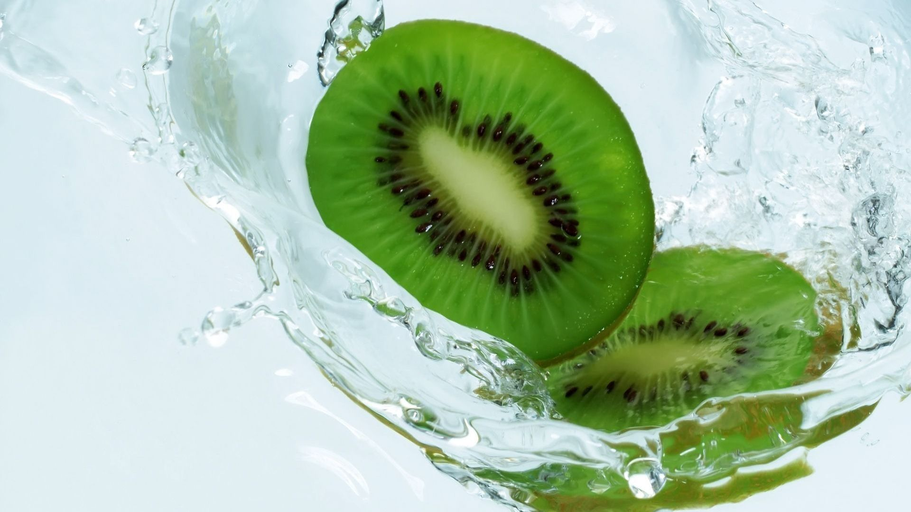
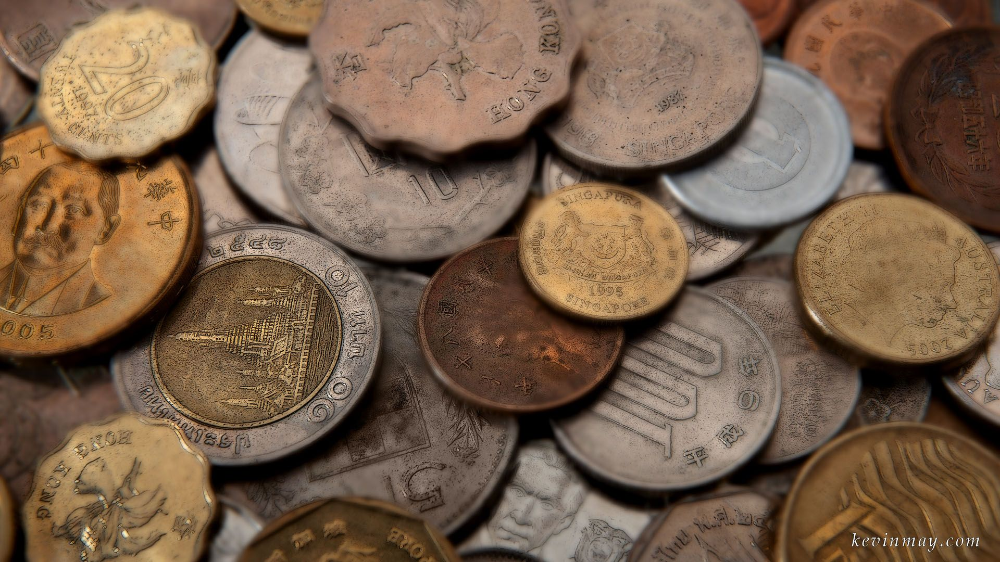

# 02. 레이아웃과 기본 위젯 사용하기

## 02-1 대표적인 레이아웃 살펴보기

### 안드로이드에서 제공하는 대표적인 레이아웃

| 레이아웃 이름   | 설명                                                         |
| --------------- | ------------------------------------------------------------ |
| 제약 레이아웃   | 뷰와 뷰 사이에 제약조건을 설정하여 화면을 구성하는 방법, 안드로이드 스튜디오에서 자동으로 활용하는 레이아웃 |
| 리니어 레이아웃 | 수평 혹은 수직 중에 한 쪽 방향으로 뷰를 구성하는 방법        |
| 상대 레이아웃   | 부모(상위) 뷰 혹은 다른 뷰를 기준으로 상대적인 위치를 구성하는 방법 |
| 프레임 레이아웃 | 여러 개의 뷰가 중첩되어 쌓이는 형태로 구성하는 방법, 가장 단순하지만 여러개의 뷰를 중첩한 후 각 뷰를 전환하여 보여주는 방식으로 자주 사용함 |
| 테이블 레이아웃 | 격자 모양으로 배열을 사용하여 화면을 구성하는 방법           |
| 절대 레이아웃   | 뷰의 위치를 좌표값으로 설정하는 방법                         |


### 뷰페이저, 뷰플리퍼 예시

뷰페이저 예시 : https://github.com/jrj8819/android-programming-class/tree/master/example/ViewPager

뷰플리퍼 예시 : https://github.com/jrj8819/android-programming-class/tree/master/example/ViewFlipper


## 02-7 기본 위젯들

### 이미지뷰 활용하기

이미지 뷰는 앱에서 이미지를 표현할때 활용하는 뷰이다, 우선 다음 퀴즈를 진행해 보자


### Quiz) 다음 이미지들을 다운로드하여 이미지를 앱에 출력하여 보자. (가상머신, 스마트폰 모두 실행해 볼 것)







### 이미지 리사이징

고용량 고해상도 이미지를 처리하기 위해 필요한 메모리를 줄이기 위해 이미지를 리사이징한다.

```java
iv_city = (ImageView)findViewById(R.id.iv_city);
iv_kiwi = (ImageView)findViewById(R.id.iv_kiwi);
iv_money = (ImageView)findViewById(R.id.iv_money);

//out of memory
BitmapFactory.Options options = new BitmapFactory.Options();
options.inSampleSize = 4; // 1/inSampleSize resize 2, 4, 8, 16

// 1/inSampleSize 비율로 리사이징
Bitmap bitmap_city = BitmapFactory.decodeResource(getResources(), R.drawable.city, options);
Bitmap bitmap_kiwi = BitmapFactory.decodeResource(getResources(), R.drawable.kiwi, options);
Bitmap bitmap_money = BitmapFactory.decodeResource(getResources(), R.drawable.money, options);

// 200. 200 으로 리사이징
Bitmap bitmap_city_resize = Bitmap.createScaledBitmap(bitmap_city, 350, 200, true);
Bitmap bitmap_kiwi_resize = Bitmap.createScaledBitmap(bitmap_kiwi, 350, 200, true);
Bitmap bitmap_money_resize = Bitmap.createScaledBitmap(bitmap_money, 350, 200, true);

iv_city.setImageBitmap(bitmap_city_resize);
iv_kiwi.setImageBitmap(bitmap_kiwi_resize);
iv_money.setImageBitmap(bitmap_money_resize);
```


### scaleType

이미지가 이미지 뷰의 크기보다 클 경우에 화면에 어떤 방식이로 표시할 것인지 설정할 수 있는 이미지 뷰의 속성이 있다.

| 속성값       | 설명                                                         |
| ------------ | ------------------------------------------------------------ |
| center       | 이미지의 원래 크기에서 가운데로 잘림없이 배치한다.           |
| centerCrop   | 이미지를 가운데에 배치하고 이미지 뷰의 높이 혹은 너비가 맞지 않으면 이미지 뷰에 맞게 늘이면서 다른 한쪽도 비율을 늘려서 표현한다, |
| centerInside | 이미지를 가운데에 배치하고, 이미지 뷰의 높이 혹은 너비가 맞지 않으면 이미지 뷰에 맞게 줄이면서 다른 한쪽도 비율을 줄여서 표한다. |
| fitCenter    | 이미지 크기를 이미지 뷰의 크기에 맞게 줄이되 이미지뷰 중앙에 맞추어 표현한다. |
| fitEnd       | 이미지 크기를 이미지 뷰의 크기에 맞게 줄이되 이미지뷰 오른쪽 아래에 맞추어 표현한다, |
| fitStart     | 이미지 크기를 이미지 뷰의 크기에 맞게 줄이되 이미지 시작지점을 왼쪽 상단에 맞추어 표현한다. |
| fitXY        | 이미지 크기에 상관없이 이미지뷰 크기에 따라 이미지를 맞추어 표현한다. |
| matrix       | 이미지의 크기를 늘이거나 줄이지 않고 그대로 표현한다.        |


